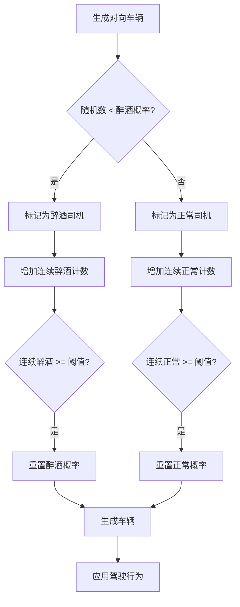
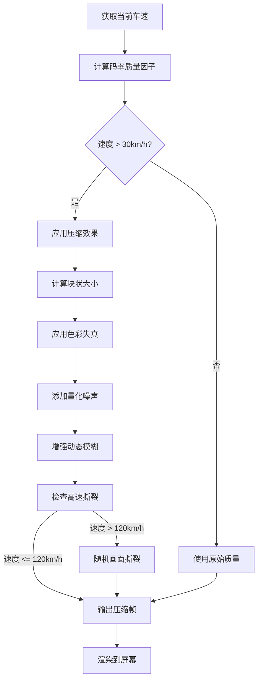
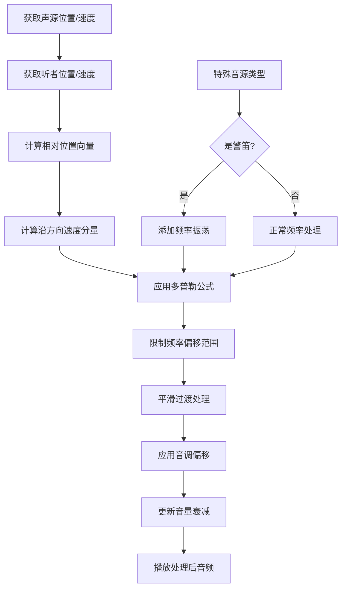

+++
date = '2025-12-15T22:45:16+08:00'
draft = false
title = 'Flashcam游戏项目TODO列表与实现系统'
comments = true
+++

# 赛车游戏项目TODO列表与实现系统

## 1. 核心引擎架构

### TODO列表
- [ ] **引擎架构设计**
  - [ ] 选择Rust作为主逻辑语言，C++作为性能关键模块（物理、渲染）
  - [ ] 设计FFI接口层，实现Rust与C++的无缝通信
  - [ ] 实现ECS架构（使用Bevy或自定义）
  - [ ] 使用CMake构建跨平台项目

- [ ] **行车记录仪视角系统**
  - [ ] 实现第一人称摄像机，位置固定在挡风玻璃下方
  - [ ] 添加镜头抖动效果（基于路面颠簸和速度）
  - [ ] 实现镜头污渍和雨滴效果
  - [ ] 添加镜头眩光和光晕效果

## 2. 渲染系统

### TODO列表
- [ ] **IES光照系统**
  - [ ] 实现IES光度分布文件解析器，支持.lm和.ies格式
  - [ ] 创建车头灯光源函数，使用IES配置文件模拟真实光束分布
  - [ ] 实现路灯和环境光源的IES支持
  - [ ] 添加动态光适应（HDR）系统，处理明暗变化

- [ ] **写实材质与特效**
  - [ ] 实现PBR材质系统，支持金属度、粗糙度、环境光遮蔽
  - [ ] 创建车漆材质，包含清漆层、金属颗粒效果
  - [ ] 实现动态水坑反射和路面湿润效果
  - [ ] 添加体积雾效果，增强夜间氛围

- [ ] **动态环境渲染**
  - [ ] 实现夜晚时间系统，动态月光和星光
  - [ ] 创建森林植被LOD系统，优化性能
  - [ ] 实现动态天气系统（雨、雾）
  - [ ] 添加后处理效果：运动模糊、景深、色差

## 3. 物理与车辆系统

### TODO列表
- [ ] **车辆物理模型**
  - [ ] 实现基于质量、惯性张量、悬挂的物理模型
  - [ ] 创建轮胎抓地力模型，考虑路面材质、速度、温度
  - [ ] 实现空气动力学系统（下压力、阻力）
  - [ ] 添加车辆损坏系统，影响操控性能

### 车辆量化标准
| 车辆型号 | 质量(kg) | 马力(HP) | 0-60mph(s) | 最高速度(km/h) | 转向比 | 传动比 | 悬挂硬度 | 刹车距离(100-0km/h)(m) |
|----------|----------|----------|------------|----------------|--------|--------|----------|------------------------|
| 宝马M1 | 1300 | 277 | 5.6 | 265 | 15.0:1 | 3.45:1 | 0.85 | 38.2 |
| 兰博基尼Countach LP400 | 1485 | 375 | 5.4 | 300 | 14.5:1 | 3.73:1 | 0.92 | 36.8 |
| 日产S13 (Silvia) | 1130 | 180 | 7.2 | 225 | 16.0:1 | 4.10:1 | 0.78 | 41.5 |
| 法拉利288 GTO | 1160 | 400 | 4.9 | 306 | 13.0:1 | 3.54:1 | 0.95 | 35.1 |
| 保时捷924 | 1100 | 150 | 8.4 | 210 | 17.0:1 | 3.89:1 | 0.72 | 43.8 |

## 4. AI交通与野生动物系统

### TODO列表
- [ ] **对向车辆AI**
  - [ ] 实现车道保持算法，限制在双车道内
  - [ ] 创建车辆行为树：正常驾驶、超车、避让
  - [ ] 添加刹车灯和转向灯逻辑

- [ ] **醉酒司机系统**
  - [ ] **概率公式**：
    ```
    P_drunk(n) = base_probability - (consecutive_sober_cars × 0.05)
    if consecutive_drunk_cars >= max_consecutive_drunk:
        force_drunk = true
        consecutive_drunk_cars = 0
    ```
  - [ ] 实现醉酒行为：车道摇摆、速度不稳定、反应迟钝
  - [ ] 添加酒精测试视觉效果（模糊、重影）

- [ ] **野生动物系统**
  - [ ] 随机生成鹿群，遵循泊松分布
  - [ ] 实现鹿的路径查找，避免车辆
  - [ ] 添加碰撞检测和物理反应

- [ ] **昆虫趋光系统**
  - [ ] 实现基于光源强度的昆虫生成算法
  - [ ] 创建昆虫飞行轨迹，趋向车灯和路灯
  - [ ] 添加昆虫撞击挡风玻璃的音效和视觉效果



## 5. 环境与赛道系统

### TODO列表
- [ ] **美国西部山区赛道**
  - [ ] 使用Heightmap生成地形，添加森林植被
  - [ ] 创建双车道道路网格，包含路肩和护栏
  - [ ] 实现道路材质变化（沥青、砂石、湿滑区域）
  - [ ] 添加路标、护栏、路灯等环境细节

- [ ] **护栏剐蹭系统**
  - [ ] 实现基于碰撞点的刮擦效果
  - [ ] 创建金属刮擦音效和火花粒子效果
  - [ ] 添加车辆操控影响（转向阻力增加、速度损失）

## 6. 游戏玩法系统

### TODO列表
- [ ] **加油站系统**
  - [ ] **油量消耗公式**：
    ```
    fuel_consumption_rate = base_consumption × (1 + speed_factor × current_speed²)
    
    base_consumption_table = {
        "宝马M1": 0.15,    // L/s at idle
        "兰博基尼Countach LP400": 0.18,
        "日产S13": 0.12,
        "法拉利288 GTO": 0.20,
        "保时捷924": 0.10
    }
    
    speed_factor = 0.0002  // 每km/h增加的消耗系数
    ```
  - [ ] **氮气系统**：
    - [ ] 氮气充能公式：`nitro_charge = base_charge + (engine_rpm × rpm_factor)`
    - [ ] 实现氮气加速效果（速度提升、视觉特效、音效变化）
  
- [ ] **加油站交互**
  - [ ] 实现停车对准检测
  - [ ] 创建加油动画和进度条
  - [ ] 添加冷却时间（CD）机制：
    ```
    cooldown_time = base_cooldown × (fuel_amount + nitro_amount)
    base_cooldown = 3.0  // seconds per liter
    ```

## 7. 音频系统

### TODO列表
- [ ] **车辆音效**
  - [ ] 实现基于RPM的引擎声音分层
  - [ ] 添加换挡音效和离合器效果
  - [ ] 创建轮胎摩擦音效（基于路面材质和滑移率）

- [ ] **环境音效**
  - [ ] 实现3D空间化环境音（风声、虫鸣、远处动物）
  - [ ] **多普勒效应系统**
  - [ ] 创建碰撞音效系统（护栏、鹿、其他车辆）

---

## 8. 新增：行车记录仪码率压缩系统

### 系统设计
**核心概念**：模拟真实行车记录仪在不同速度下的视频压缩质量变化，高速时码率压缩严重，低速时质量恢复。

### 量化标准
| 速度区间(km/h) | 码率(Mbps) | 压缩质量 | 视觉效果 |
|---------------|-----------|----------|----------|
| 0-30 | 16.0 | 无损 | 清晰，无压缩伪影 |
| 30-60 | 12.0 | 轻度压缩 | 轻微块状，边缘模糊 |
| 60-100 | 8.0 | 中度压缩 | 明显块状，色彩失真 |
| 100-150 | 4.0 | 重度压缩 | 严重块状，动态模糊增强 |
| 150+ | 2.0 | 极度压缩 | 画面撕裂，色彩分离 |

### 实现公式
```rust
// Rust: 码率压缩计算
struct DashcamCompressionSystem {
    base_bitrate: f32,  // 基础码率 16.0 Mbps
    speed_thresholds: [f32; 5],  // [0.0, 30.0, 60.0, 100.0, 150.0]
    bitrate_multipliers: [f32; 5],  // [1.0, 0.75, 0.5, 0.25, 0.125]
    compression_artifacts: CompressionArtifacts,
}

impl DashcamCompressionSystem {
    fn calculate_current_bitrate(&self, speed_kmh: f32) -> f32 {
        let mut multiplier = 1.0;
        
        for (i, &threshold) in self.speed_thresholds.iter().enumerate() {
            if speed_kmh >= threshold {
                multiplier = self.bitrate_multipliers[i];
            }
        }
        
        self.base_bitrate * multiplier
    }
    
    fn generate_compression_artifacts(&self, speed_kmh: f32, frame: &mut Frame) {
        let quality = self.calculate_current_bitrate(speed_kmh) / self.base_bitrate;
        
        // 块状压缩效果
        let block_size = (8.0 * (1.0 - quality)).max(1.0) as u32;
        apply_block_compression(frame, block_size);
        
        // 色彩失真
        let color_distortion = 0.1 * (1.0 - quality);
        apply_color_distortion(frame, color_distortion);
        
        // 动态模糊增强
        let motion_blur_factor = 0.5 * (1.0 - quality);
        apply_enhanced_motion_blur(frame, motion_blur_factor);
        
        // 画面撕裂效果 (高速时)
        if speed_kmh > 120.0 && rand::random::<f32>() < 0.1 * (1.0 - quality) {
            apply_screen_tearing(frame, rand::random::<f32>() * 0.1);
        }
    }
}

// 压缩伪影参数
struct CompressionArtifacts {
    block_artifact_strength: f32,    // 0.0 - 1.0
    color_bleeding: f32,             // 0.0 - 1.0  
    quantization_noise: f32,         // 0.0 - 1.0
    motion_compensation_errors: f32, // 0.0 - 1.0
}
```

### 后处理效果实现
```cpp
// C++: OpenGL/Vulkan后处理着色器
// dashcam_compression.frag
uniform float u_compression_quality; // 0.0 - 1.0
uniform float u_speed_kmh;
uniform sampler2D u_scene_texture;

vec4 applyDashcamCompression(vec2 uv) {
    vec4 color = texture(u_scene_texture, uv);
    
    // 1. 块状压缩效果
    float block_size = 8.0 * (1.0 - u_compression_quality);
    vec2 block_uv = floor(uv * block_size) / block_size;
    vec4 block_color = texture(u_scene_texture, block_uv);
    color = mix(color, block_color, 0.3 * (1.0 - u_compression_quality));
    
    // 2. 色彩失真 - YUV色彩空间压缩
    vec3 yuv = rgb2yuv(color.rgb);
    yuv.y = floor(yuv.y * 16.0) / 16.0; // 降低亮度精度
    yuv.uv = floor(yuv.uv * 8.0) / 8.0; // 降低色度精度
    color.rgb = yuv2rgb(yuv);
    
    // 3. 量化噪声
    float noise = fract(sin(dot(uv, vec2(12.9898, 78.233))) * 43758.5453);
    color.rgb += (noise - 0.5) * 0.02 * (1.0 - u_compression_quality);
    
    // 4. 动态模糊增强 (基于速度)
    if (u_speed_kmh > 80.0) {
        float blur_amount = min(u_speed_kmh / 200.0, 1.0) * (1.0 - u_compression_quality);
        vec4 blurred = vec4(0.0);
        for (int i = -3; i <= 3; i++) {
            float offset = float(i) * 0.005 * blur_amount;
            blurred += texture(u_scene_texture, uv + vec2(offset, 0.0));
        }
        blurred /= 7.0;
        color = mix(color, blurred, 0.4 * blur_amount);
    }
    
    return color;
}
```

### 系统流程图


## 9. 新增：多普勒效应音频系统

### 系统设计
**核心概念**：当声源和听者之间存在相对运动时，声音频率发生变化。接近时频率升高，远离时频率降低。

### 物理公式
```
f' = f × (v_sound ± v_listener) / (v_sound ∓ v_source)

其中：
- f' = 观察到的频率
- f = 原始频率
- v_sound = 声音在空气中传播速度 (343 m/s at 20°C)
- v_listener = 听者速度 (沿声源到听者连线方向)
- v_source = 声源速度 (沿声源到听者连线方向)
- 符号规则：接近时用+，远离时用-
```

### 量化标准
| 相对速度(m/s) | 频率变化比例 | 听觉效果 |
|--------------|-------------|----------|
| 0 (静止) | 1.00x | 无变化 |
| 10 m/s (36 km/h) | 0.97x - 1.03x | 轻微变化 |
| 20 m/s (72 km/h) | 0.94x - 1.06x | 明显变化 |
| 30 m/s (108 km/h) | 0.91x - 1.09x | 强烈变化 |
| 40 m/s (144 km/h) | 0.88x - 1.12x | 非常明显 |

### 实现公式
```rust
// Rust: 多普勒效应计算
struct DopplerEffectSystem {
    speed_of_sound: f32,  // 343.0 m/s at 20°C
    temperature: f32,     // 影响声速
    humidity: f32,        // 影响声速
    max_frequency_shift: f32,  // 最大频率偏移限制
}

impl DopplerEffectSystem {
    fn calculate_doppler_shift(
        &self,
        source_pos: Vec3,
        source_vel: Vec3,
        listener_pos: Vec3,
        listener_vel: Vec3,
        original_frequency: f32
    ) -> f32 {
        // 计算声源到听者的向量
        let relative_pos = listener_pos - source_pos;
        let distance = relative_pos.length();
        
        if distance < 0.1 {  // 避免除零
            return original_frequency;
        }
        
        // 计算单位方向向量
        let direction = relative_pos / distance;
        
        // 计算沿方向的速度分量
        let source_speed_along = source_vel.dot(direction);
        let listener_speed_along = listener_vel.dot(direction);
        
        // 应用多普勒公式
        let numerator = self.speed_of_sound + listener_speed_along;
        let denominator = self.speed_of_sound - source_speed_along;
        
        if denominator.abs() < 0.1 {  // 避免除零
            return original_frequency;
        }
        
        let shift_ratio = numerator / denominator;
        
        // 限制频率偏移范围 (0.5x - 2.0x)
        let clamped_ratio = shift_ratio.clamp(0.5, 2.0);
        
        // 应用最大偏移限制
        let final_ratio = clamped_ratio.clamp(
            1.0 - self.max_frequency_shift,
            1.0 + self.max_frequency_shift
        );
        
        original_frequency * final_ratio
    }
    
    fn update_speed_of_sound(&mut self) {
        // 根据温度调整声速: v = 331.3 + 0.606 × T(°C)
        self.speed_of_sound = 331.3 + 0.606 * self.temperature;
        
        // 湿度影响 (简化)
        if self.humidity > 0.6 {
            self.speed_of_sound *= 1.01;  // 高湿度略微增加声速
        }
    }
}
```

### C++音频处理实现
```cpp
// C++: 实时音频处理 (使用OpenAL或FMOD)
class DopplerAudioProcessor {
public:
    struct AudioSource {
        ALuint buffer;
        ALuint source;
        Vec3 position;
        Vec3 velocity;
        float base_frequency;
        float current_pitch;
    };
    
    void updateDopplerEffects(const Vec3& listener_position, const Vec3& listener_velocity) {
        for (auto& source : audio_sources_) {
            float shifted_freq = doppler_system_.calculate_doppler_shift(
                source.position,
                source.velocity,
                listener_position,
                listener_velocity,
                source.base_frequency
            );
            
            // 计算音调偏移 (以半音为单位)
            float pitch_shift = 12.0f * std::log2(shifted_freq / source.base_frequency);
            
            // 平滑过渡，避免突变
            source.current_pitch = lerp(source.current_pitch, pitch_shift, 0.1f);
            
            // 应用到音频源
            alSourcef(source.source, AL_PITCH, std::pow(2.0f, source.current_pitch / 12.0f));
            
            // 更新音量基于距离 (平方反比定律)
            float distance = (listener_position - source.position).length();
            float attenuation = 1.0f / (1.0f + distance * distance * 0.01f);
            alSourcef(source.source, AL_GAIN, attenuation);
        }
    }
    
    // 适用于警笛、引擎等特殊效果
    void applySirenDoppler(AudioSource& siren, float time) {
        // 警笛频率随时间变化
        float base_siren_freq = 600.0f + 200.0f * sinf(time * 2.0f * M_PI);
        
        float shifted_freq = doppler_system_.calculate_doppler_shift(
            siren.position,
            siren.velocity,
            listener_position_,
            listener_velocity_,
            base_siren_freq
        );
        
        // 动态生成警笛波形
        generateSirenWaveform(siren.buffer, shifted_freq, 44100);
    }
    
private:
    DopplerEffectSystem doppler_system_;
    Vec3 listener_position_;
    Vec3 listener_velocity_;
    std::vector<AudioSource> audio_sources_;
};
```

### 多普勒效应应用对象
| 音源类型 | 基础频率(Hz) | 多普勒敏感度 | 特殊处理 |
|----------|-------------|-------------|----------|
| 警车警笛 | 600-800 | 高 | 频率随时间振荡 |
| 消防车警笛 | 400-600 | 高 | 低频为主 |
| 救护车警笛 | 700-900 | 高 | 高频为主 |
| 其他车辆引擎 | 50-500 | 中 | 根据RPM变化 |
| 摩托车引擎 | 100-800 | 高 | 高频突出 |
| 鹿叫声 | 1000-3000 | 低 | 短促音效 |
| 路边动物 | 200-2000 | 低 | 环境音效 |
| 风声 | 20-200 | 低 | 低通滤波 |

### 系统流程图


## 10. 技术实现细节 - 扩展

### IES光源函数实现
```cpp
// C++ IES Profile解析器 - 扩展版
class IESProfile {
public:
    struct PhotometricData {
        float candela_values[361][181]; // 水平360° + 1, 垂直180° + 1
        float multiplier;
        float intensity;
        float beam_angle;  // 光束角度
        float field_angle; // 场角
        Vec3 color_temperature; // 色温校正
    };
    
    bool loadFromFile(const std::string& filename);
    glm::vec3 calculateIlluminance(const glm::vec3& direction, float distance, float intensity) const;
    float getBeamSpread(float horizontal_angle, float vertical_angle) const;
    
    // 热插拔支持
    void updateFromConfig(const IESConfig& config);
    
private:
    PhotometricData data;
    bool parseStandardIES(const std::string& content);
    bool parseCSVFormat(const std::string& content);
    
    // 优化：使用查表法加速计算
    void precomputeLookupTables();
    std::array<std::array<float, 361>, 181> lookup_table_;
};
```

### 随机数生成器优化 - 扩展
```rust
// Rust 醉酒司机概率管理 - 扩展版
struct AdvancedDrunkDriverSystem {
    base_probability: f32,          // 基础概率 0.15
    current_probability: f32,       // 当前概率
    consecutive_sober: u32,         // 连续正常车辆数
    consecutive_drunk: u32,         // 连续醉酒车辆数
    max_consecutive_drunk: u32,     // 最大连续醉酒数 3
    max_consecutive_sober: u32,     // 最大连续正常数 10
    probability_decay: f32,         // 概率衰减 0.05
    time_of_day_factor: f32,        // 时间影响因子 (夜晚概率更高)
    weather_factor: f32,            // 天气影响因子 (雨天概率更高)
    location_factor: f32,           // 位置影响因子 (酒吧附近概率高)
}

impl AdvancedDrunkDriverSystem {
    fn should_generate_drunk_driver(&mut self, rng: &mut ThreadRng, game_state: &GameState) -> bool {
        // 应用环境因子
        let mut adjusted_probability = self.current_probability;
        
        // 时间影响 (22:00-06:00 概率增加)
        if game_state.is_night_time() {
            adjusted_probability *= self.time_of_day_factor;  // 1.5x
        }
        
        // 天气影响 (雨天概率增加)
        if game_state.is_rainy() {
            adjusted_probability *= self.weather_factor;  // 1.3x
        }
        
        // 位置影响 (接近酒吧/夜店区域)
        if game_state.near_bar_district() {
            adjusted_probability *= self.location_factor;  // 2.0x
        }
        
        // 强制生成检查
        if self.consecutive_drunk >= self.max_consecutive_drunk {
            self.reset_counters();
            return true;
        }
        
        if self.consecutive_sober >= self.max_consecutive_sober {
            self.reset_counters();
            return rng.gen_bool(adjusted_probability as f64);
        }
        
        let result = rng.gen_bool(adjusted_probability as f64);
        
        if result {
            self.consecutive_drunk += 1;
            self.consecutive_sober = 0;
            // 概率衰减
            self.current_probability = (self.current_probability - self.probability_decay).max(0.05);
        } else {
            self.consecutive_sober += 1;
            self.consecutive_drunk = 0;
            // 概率恢复
            self.current_probability = (self.current_probability + self.probability_decay * 0.5).min(0.3);
        }
        
        result
    }
    
    fn reset_counters(&mut self) {
        self.consecutive_drunk = 0;
        self.consecutive_sober = 0;
        self.current_probability = self.base_probability;
    }
}
```

## 11. 项目里程碑 - 更新

### 阶段1：核心框架（4周）
- [ ] 完成Rust+C++混合架构搭建
- [ ] 实现行车记录仪视角基础
- [ ] **实现行车记录仪码率压缩原型**
- [ ] 实现基础物理引擎
- [ ] 完成一辆车辆的模型和物理参数

### 阶段2：环境与AI（6周）
- [ ] 完成美国西部山区赛道
- [ ] 实现双车道交通系统
- [ ] 添加醉酒司机和野生动物系统
- [ ] 完成基础光照和IES系统
- [ ] **实现多普勒效应音频系统原型**

### 阶段3：游戏系统（4周）
- [ ] 实现加油站和氮气系统
- [ ] 完成所有5辆车辆的建模和参数
- [ ] 完成行车记录仪码率压缩完整系统
- [ ] 完成多普勒效应完整系统
- [ ] 添加音效和音乐
- [ ] 实现UI和游戏菜单

### 阶段4：优化与发布（2周）
- [ ] 性能优化（LOD、遮挡剔除）
- [ ] **优化码率压缩算法性能**
- [ ] **优化多普勒音频计算性能**
- [ ] Bug修复和平衡调整
- [ ] 打包发布

## 12. 关键技术挑战 - 扩展

- [ ] **Rust-C++ FFI性能优化**：使用零拷贝数据结构，避免频繁内存分配
- [ ] **真实光照渲染**：IES配置文件需要精确模拟车头灯的光束分布
- [ ] **物理精度**：车辆动力学需要平衡真实性和游戏性
- [ ] **随机系统平衡**：醉酒司机和野生动物的出现频率需要仔细调校
- [ ] **性能优化**：夜间场景的光照计算和体积雾效果对GPU要求较高
- [ ] **实时码率压缩**：需要在GPU上高效实现视频压缩效果，不影响帧率
- [ ] **音频实时处理**：多普勒效应需要实时计算和应用，避免音频延迟
- [ ] **跨平台音频API**：需要抽象不同平台的音频API（Windows WASAPI, macOS Core Audio, Linux ALSA）

## 13. 性能优化指标

### 码率压缩系统性能目标
| 平台 | 目标帧率 | 最大压缩计算时间 | GPU内存占用 |
|------|----------|------------------|-------------|
| PC (高端) | 60 FPS | 1.0 ms | 128 MB |
| PC (中端) | 45 FPS | 1.5 ms | 64 MB |
| PC (低端) | 30 FPS | 2.5 ms | 32 MB |

### 多普勒效应系统性能目标
| 音源数量 | CPU占用 | 延迟 | 音质损失 |
|----------|---------|------|----------|
| 1-10个 | < 0.5 ms | < 10 ms | 无感知 |
| 10-50个 | < 2.0 ms | < 20 ms | 轻微 |
| 50-100个 | < 5.0 ms | < 50 ms | 可感知 |

### 优化策略
1. **码率压缩优化**：
   - 使用计算着色器预计算压缩查找表
   - 对低质量区域使用更低分辨率渲染
   - 动态调整压缩质量基于GPU负载

2. **多普勒效应优化**：
   - 空间分区，只处理可见范围内的音源
   - 使用固定点数计算替代浮点数
   - 批量处理相似音源